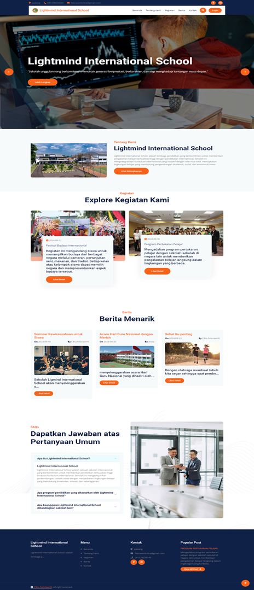
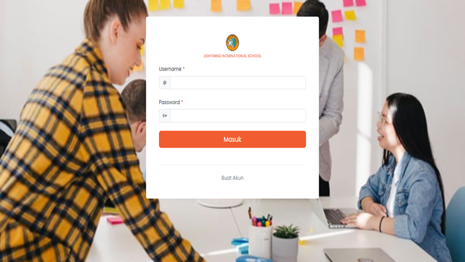
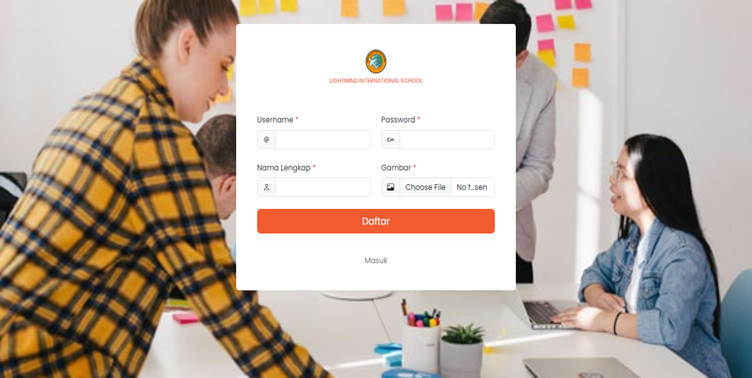
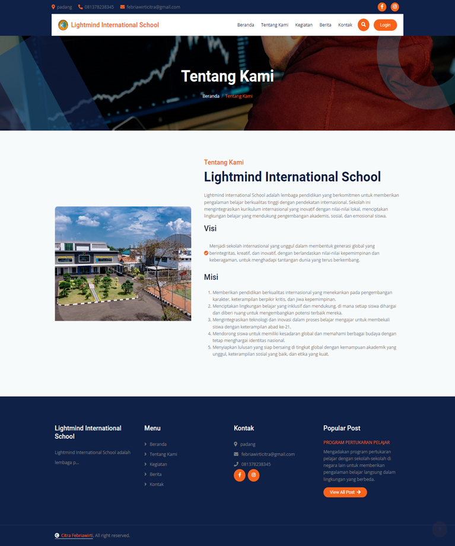
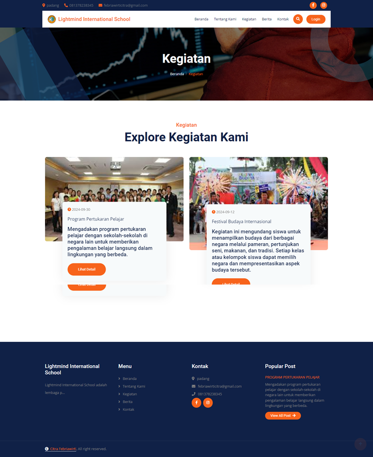
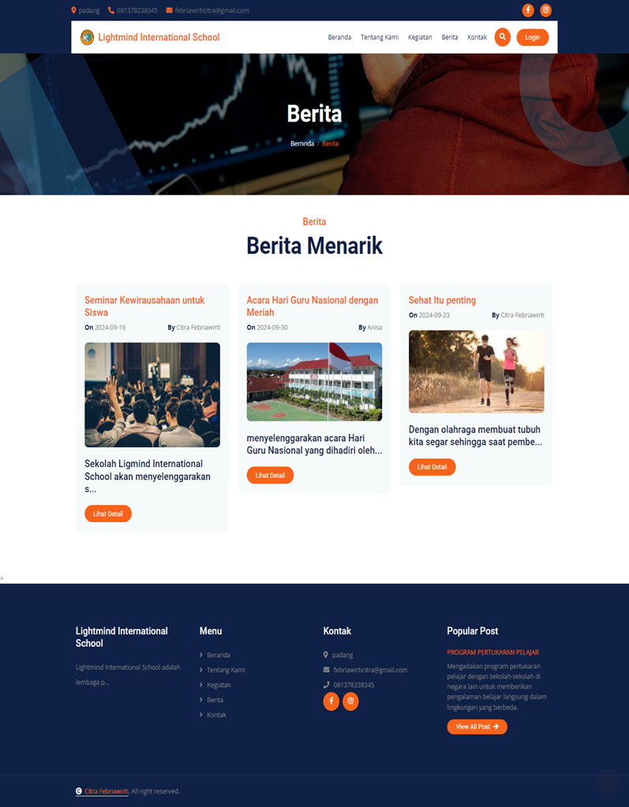
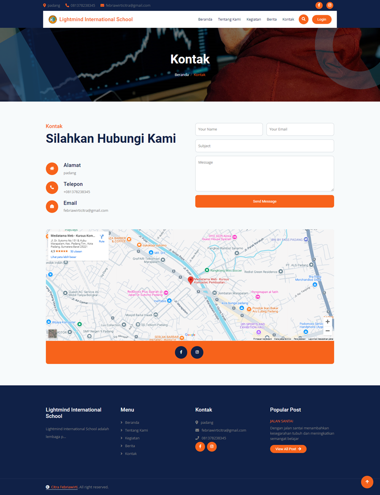
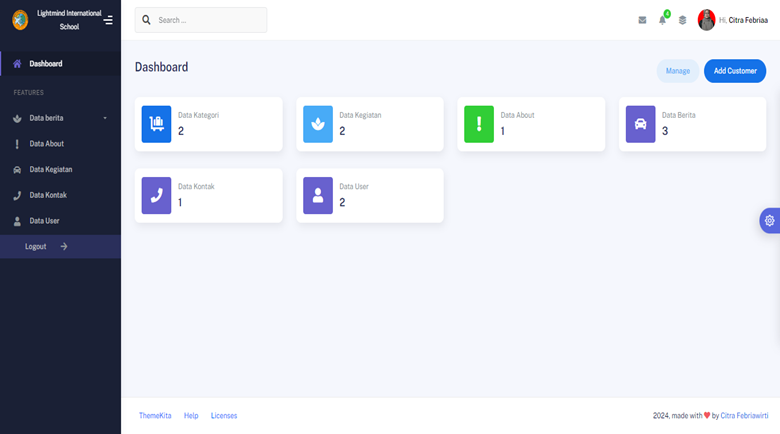

# Website Sekolah Lightmind International School

## Fitur
- Login (sesuai Username/Password)
- Register
- Beranda
- Tentang Kami
- Kegiatan
- Berita
- Kontak

## Instalasi
- Download semua file
- Taruh di htdocs XAMPP
- Buat database dengan nama "db_sekolah" di MySQL Server
- Import SQL File dari folder database (gunakan yang db_sekolah)

## Documentation
- Login Page

- Regsiter Page

- Beranda

- Tentang Kami

- Kegiatan

- Berita

- Kontak

- Admin

## Akun Login
## ♨️Pembagian Tugas
| No  | Level          | Email / Password      | 
| --- | -------------- | ------------------ |
| 1   | Admin       | admin / 123      |

## Teknologi

| No  | Bidang      | Tech       |
| --- | -------------- | ------------------ |
| 1   | Frontend       |        |
| 2   | Backend        |        |
| 3   | Basis Data   | 	 |

#### <i>Major Update<i>
<i>Ganti nama database di koneksi.php (di dalam folder components) dengan nama database yang ingin dipakai. Gunakan database terbaru "db_sekolah" yang terdapat di dalam folder database. <bold> Jika muncul error saat pertama kali login, langsung direfresh, error itu karena timeout XAMPP yang diset 30 detik, sedangkan database ini butuh lebih dari 30 detik saat pertama kali login.</bold><i> 